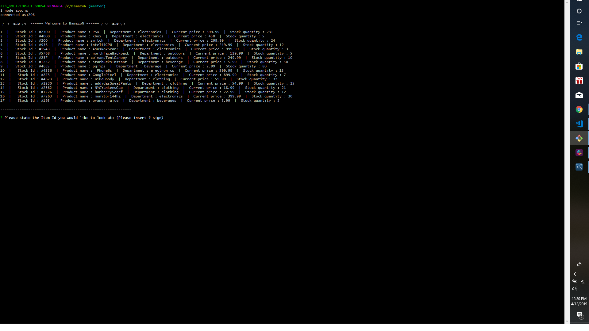
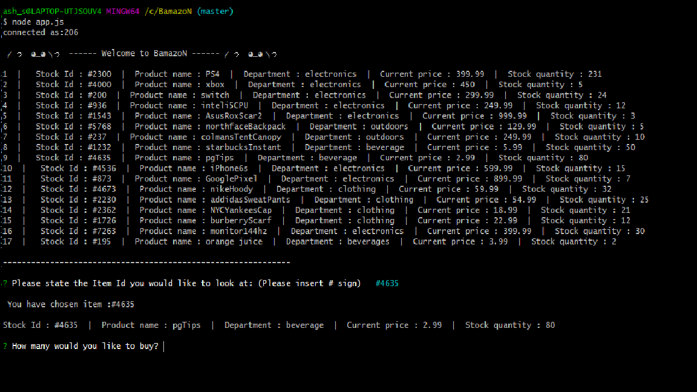
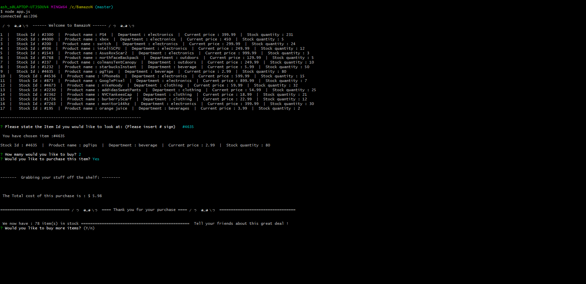
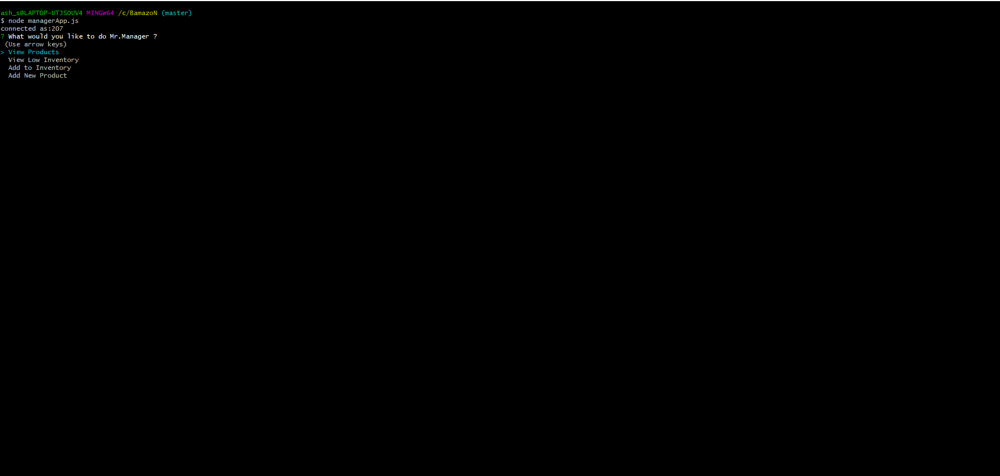
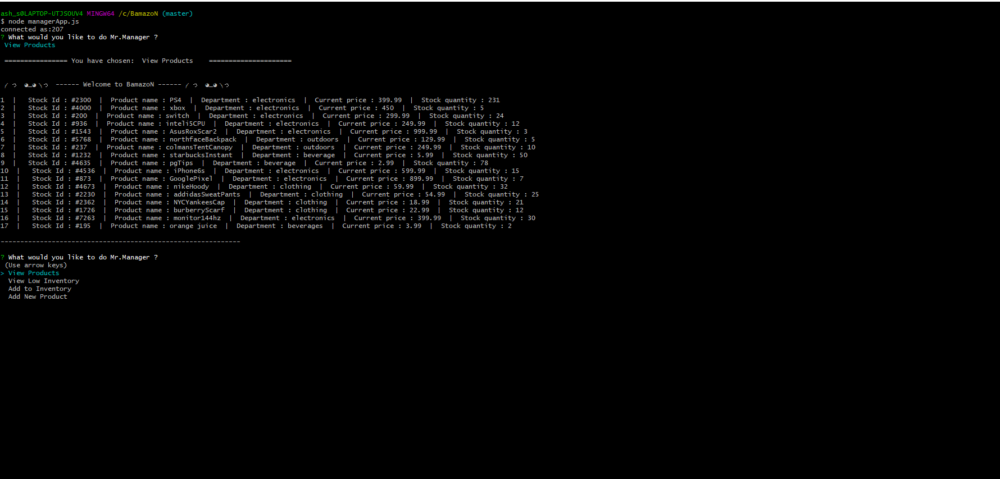
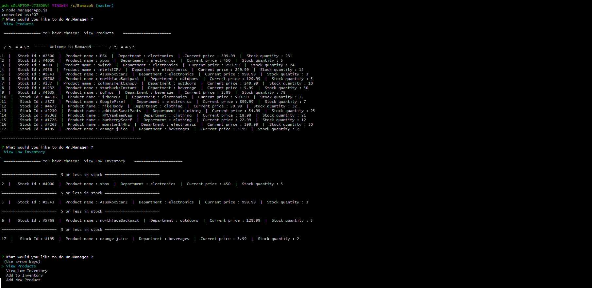
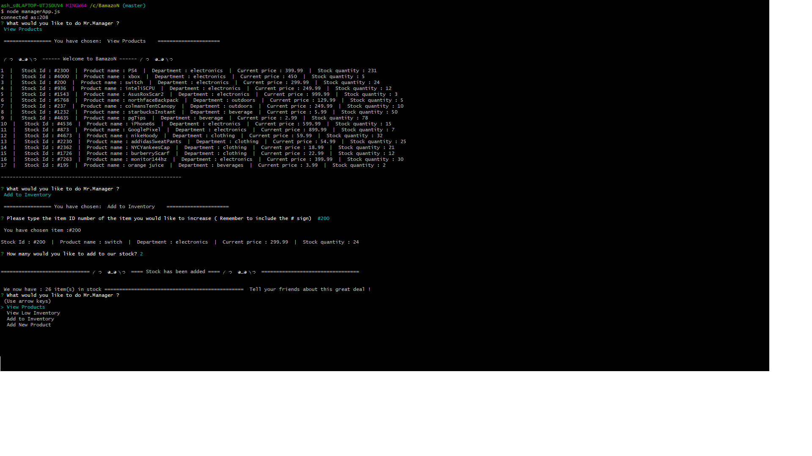
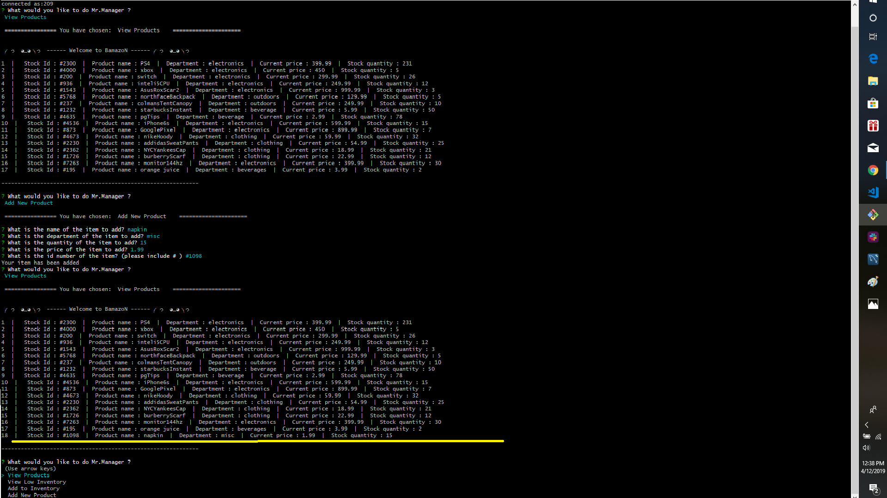

---

BamazoN
---

*BamazoN is a store front, using node and MySql to create a user interface for both the customer and manager. 
---

**What can BamazoN do ?**

All you need to know:

BamazoN will run as two primary users, the customer and the manager.

---

**As a customer**, you are able to view all of the stock and item information, choosing which item to purchase, total cost and stock available.

---

**As a manager**, you are able to work with a menu system to either view inventory, view stock running low, add new stock to the inventory and add new items to the "shop floor".

---
**All of these experiences have been created with a good user experience in mind, and constant validation checks to ensure user input and backend reliability. **

**BeamazoN also uses several packages:**

Moment

DotEnv

inquirer

**Please open up in node or terminal to run the code.**

---

** please click the image to watch the video of the App running **

Here are example of my code in action:

** please click the link to watch the video of the App running **
--
https://www.youtube.com/watch?v=BsdVSMPU9rY&t=213s

---

---

------------------------------------------------------------

Here are example of my code in action:

------------------------------------------------------------
**customer buying an Item** : 

-------------------------------------------------------------
**Manager options** :

-------------------------------------------------------------

-------------------------------------------------------------

-------------------------------------------------------------

--------------------------------------------------------------

---------------------------------------------------------------
Project in Portfolio:

**Thank you for reading.
